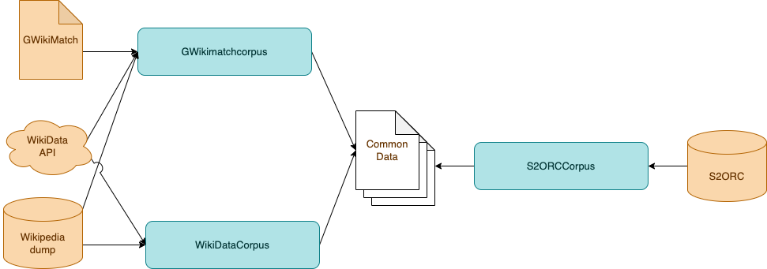

# Corpus tools

This project contains a set of tools for extracting corpora from a limited number of datasets and convert them 
into a common Xml format. The corpora contain links between documents or sections of the documents and can be used 
for training and validating models that generate semantic links between (parts of) documents.

For each dataset a separate tool (written in Python) is available, the tools use common libraries for reading the data
and generating the corpora.

- `GWikimatchcorpus.py` converts data from the [gWikiMatch dataset](https://github.com/google-research/google-research/tree/master/gwikimatch) .
- `WikiDataCorpus.py` creates a corpus using [WikiData](https://www.wikidata.org) and [Wikipedia](https://www.wikipedia.org) .
- `S2ORCCorpus.py` for obtained from the [S2ORC dataset](https://github.com/allenai/s2orc) .


## Data
The scripts combine input from various sources into a corpora. The combination of the sources per tools is depicted 
in the this diagram: 



### GWikiMatch
GWikiMatch is a benchmark dataset for the long-form document matching, is a TSV-file where each record contains a 
source and destination url from the English Wikipedia along with a similarty label (0=not similar, 1=somewhat similar 
and 2=strongly similar. The Wikipedia URL is translated to a WikiData ID, so it can easily be used in combinationw with
data obtained from Wikidata.

### WikiData API

The tools communicate with WikiData by means of their [Query interface](https://query.wikidata.org), this is a SPARQL
endpoint that gives full access to the WikiData knowledge graph. The runtime of the query on the public endpoint is limited to 60 seconds, 
and a maximum number of queries per minute. For this reason queries are cached on the filessystem to prevent the tool from accessing
Wikidata unnecessarily. All Wikidata entities have an associated id, this id can be used to obtain Wikipedia articles in multiple languages.

### Wikipedia dump
The tools don't access the Wikipedia API but instead use dumps of Wikipedia because a large amount of Wikipedia articles 
are required and the Wikipedia API has restrictions to avoid overuse. Wikipedia dumps can be obtained from [Wikimedia downloads](https://dumps.wikimedia.org/backup-index.html),
the dumps are availabe in multiple languages. 

The tools expect two files per language, a dump of all articles in a specific language on a specific date `*pages-articles-multistream.xml.bz2` 
and a index of all articles of this dump `*pages-articles-multistream.xml.bz2`. These files are being read from the `.bz2` files directly, 
so they do not need to be extracted beforehand. To extract text and sections from the articles the Python library
[WikiTextParser](https://github.com/5j9/wikitextparser) is used.

### Common file format
The selected data is written to files in a common format so they can be processed independent of the source of the data. 
The files are Xml files of which you will find an artificial example below:

```xml
<doc id="00009">
    <title>Title of the document</title>
    <links>
        <link id="09987" index="0.566" class="1" />
        <link id="33322" index="0.654" class="1"/>
        <link id="12223" index="0.777" class="1"/>
    </links>
    <section id="00009" subid="1">
        <title>Title of the section</title>
        <links>
            <link id="09987" index="0.796" class="1" />
        </links>
        <text>Text of the section</text>
    </section>
    <section id="00009" subid="2">
        <title>Title of the section</title>
        <links />
        <text>Text of the section</text>
    </section>
</doc>
```

## Details

The sections below giv a short description of the usage and details of each of the tools. 

### GWikiMatchCorpus.py
kn
Uses the GWikiMatch file to generate pairs of Wikipedia articles with a label. The filenames of the output files contain
the WikiDataID of the article. The links between sections of Wikipedia articles are not resolved and are therefor always 
empty. The variables for the variables `wikidata_enpoint`, `wikipedia_dumpdir` and `gwikimatch_dir` must be changed in
the script. The other variables are specified via the commandline:

```
usage: GWikiMatchCorpus.py [-h] -l LANGUAGE -o OUTPUT

Read articles from wikipedia based on the gWikiDataset.

arguments:
  -h, --help            show this help message and exit
  -l LANGUAGE, --language LANGUAGE
                        Language code, for example "nl" or "en"
  -o OUTPUT,   --output OUTPUT
                        Output directory
```

### WikiDataCorpus

Generates a corpus about one or more subjects. It uses the WikiData knowledge graph to determine which Wikipedia articles 
contain information about the subject, for that reason the subject is a list of WikiData ids. The semantic links 
are generated by comparing the outgoing links for each article or section. 

When a pair of articles is available in the
GWikiMatch dataset a line is written to the file `gwikimatch.tsv` in the output directory. Although this file usually will not contain
many records, it can be used as supplement to validate a model trained on this corpus. Statistics about the corpus are 
available in the file `stats.txt` in the output directory. The variables for the variables `wikidata_enpoint`, `wikipedia_dumpdir` and `gwikimatch_dir` must be changed in
the script. The other variables are specified via the commandline:

```
usage: WikiDataCorpus.py [-h] -s SUBJECTS -l LANGUAGE [-o OUTPUT]

Read articles from Wikipedia based on the WikiData knowledge graph.

arguments:
  -h, --help            show this help message and exit
  -s SUBJECTS, --subjects SUBJECTS
                        Main wikidata subjects, a comma seperated 
                        list of WikiData ids (for example "wd:Q7397")
  -l LANGUAGE, --language LANGUAGE
                        Language code, for example "nl" or "en"
  -o OUTPUT,   --output OUTPUT
                        Output directory
```

### S2ORCCorpus
Generates a corpus in the common file format from the S2ORC dataset. The tool assumes that (part of) the S2ORC has been downloaded
and extracted. The S2ORC dataset comes with a script to extract its data, S2ORCCorpus uses the directory structure created by this
script.

```
usage: S2ORCCorpus.py [-h] -s SUBJECT -p PDFPARSES -m METADATA -o OUTPUT

Read articles from wikipedia based on the gWikiDataset.

arguments:
  -h, --help            show this help message and exit
  -s SUBJECT,   --subject SUBJECT
                        Subject, for example "Computer Science"
  -p PDFPARSES, --pdfparses PDFPARSES
                        Directory with pdf_parses
  -m METADATA,  --metadata METADATA
                        Directory with meta_data
  -o OUTPUT,    --output OUTPUT
                        Output directory
```
